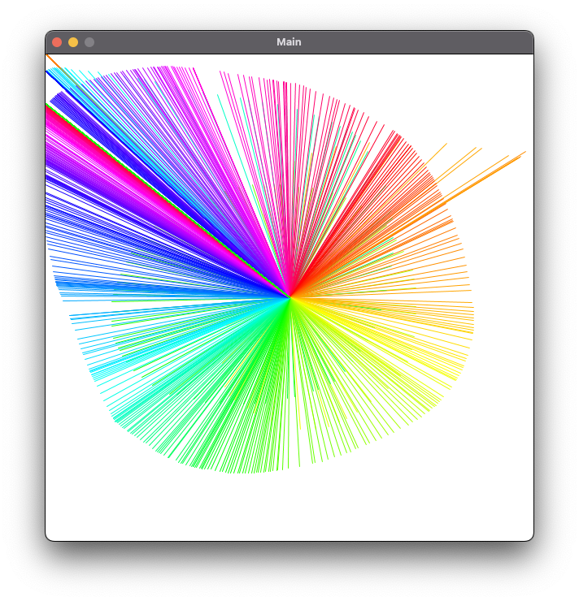

# JDK 1.8 Environment Test

## Git Clone Fail?
If your Git Clone failed, fear not. Click the Green "Code" button on GitHub for this project and choose "Download Zip". Unzip the folder to your computer and then open the project with IntelliJ. You will have additional lessons coming up which will hopefully fix any Git problems.

## Testing your 1.8 JDK

This project will check to see if your JDK 1.8 setup has been successful.

When opening a project for the first time in IntelliJ it will do several setup and downloads in the background. Wait for these to finish. If you see nothing occurring on the bottom-right part of the window IntelliJ is ready.

Follow the steps outlined below:

### 1) Run the Main.java on IntelliJ
Open the Main.java file. The easiest way to do this is to type the ```shift``` key twice on your keyboard, then type in ```Main``` and hit enter.

You will see a Green Arrow on the gutters on line #5 and line #30. Click either of these and select ```Run 'Main.main()'```


### 2) Test the Running Application
A new window should open. You can move your mouse around the screen to draw a starburst pattern.

A successful run will look something like this:



### 3) Check your console output (Run)

After a few moments of your program running, your console should display something similar to the following:

```
*********************************************************
You will verify this project ran correctly in the
"Environment Setup: Check for understanding" task.

If you are prompted in that task for the key,
the JDK8 Environment Setup key is:  ####
*********************************************************

```
The key displayed here will not be a #### for you. You may be asked for this key in the task named Environment Setup: Check for Understanding. You can always re-run this program to see the key again or you may write it down now.
